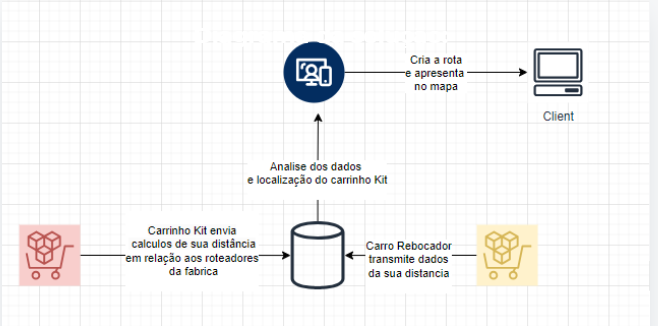

# Projeto Find2Go
## Introdução

Este projeto utiliza um ESP32, um botão, uma fita de LED e um módulo nRF24L01 como antena para coletar dados, calcular e enviar a distância calculada entre um microcontrolador e aos roteadores de WiFi para uma aplicação web contendo um mapa. A aplicação, desenvolvida no WordPress, apresenta uma interface intuitiva, composta por uma página inicial, uma página de login e uma página dedicada ao mapa. O sistema permite que, ao pressionar o botão, o sistema detecte quais carrinhos estão disponíveis, indicado por um LED.
&nbsp;

## Desenvolvimento
Este projeto utiliza uma arquitetura de Internet das Coisas (IoT) com o objetivo de localizar um carrinho, empregando um ESP32 como dispositivo principal. A seguir, são descritos os principais elementos da arquitetura, suas funcionalidades, tecnologias envolvidas e os resultados esperados.
### Arquitetura e Funcionamento
A solução IoT é composta por um ESP32 Dev Kit v1, conectado a um botão, uma fita de LED e um módulo nRF24L01, que atua como antena para comunicação. O ESP32 é responsável por rastrear e localizar a plataforma utilizando a rede Wi-Fi e o módulo de comunicação via rádio. Quando o botão é pressionado, o LED mudará de cor e notificará o ESP32 a disponibilidade do carrinho em questão, sendo o ESP32 responsável pela coleta dos dados de localização e o envio dessas informações para uma aplicação web.

A aplicação web, desenvolvida em WordPress, exibe um mapa que facilita a visualização da localização do carrinho plataforma em tempo real. Esse mapa foi montado utilizando os plugins Astra e Elementor, o que permite uma interface intuitiva e responsiva. A comunicação entre o ESP32 e a aplicação web é feita por meio de requisições HTTP, enviando dados ao servidor PHP, que interage com o banco de dados MySQL.

&nbsp;

### Tecnologias Envolvidas
-Softwares: Arduino IDE foi utilizado para a programação do ESP32, enquanto o Tinkercad auxiliou no design e simulação do hardware. A interface web foi desenvolvida no WordPress, com o uso de phpMyAdmin para a gestão do banco de dados MySQL
&nbsp;

-Linguagens: O desenvolvimento utiliza PHP para interagir com o banco de dados, C++ para programar o ESP32 e SQL para manipulação de dados.
&nbsp;

-Bibliotecas: O projeto faz uso das bibliotecas nRF24L01 e RF24 para comunicação sem fio, WiFi para conectar o ESP32 à rede, Adafruit NeoPixel para controle da fita de LED e HTTPClient para gerenciar as requisições HTTP.
&nbsp;

-Addons do WordPress: O tema Astra e o construtor de páginas Elementor foram usados para criar e estilizar o site.
&nbsp;

-Hardware: Além do ESP32 Dev Kit v1, o projeto conta com uma fita de LED, um botão de controle e o módulo de comunicação nRF24L01.
&nbsp;

## Resultados
A aplicação desenvolvida oferece uma solução para a localização de um carrinho, devolvendo informações visuais e técnicas que comprovam seu funcionamento. O site exibe um mapa, onde o objeto rastreado pode ser visualizado em tempo real. 
### Imagem do protótipo

&nbsp;

### Visualização da Página

&nbsp;

### Visualização da Página

&nbsp;

### Visualização da Página

&nbsp;

### Dificuldades enfrentadas ao longo do projeto
Durante o desenvolvimento do projeto, enfrentamos diversos desafios técnicos. O primeiro deles foi a comunicação entre a função do ESP32 e a tabela no banco de dados no WordPress. Houve dificuldades no envio correto dos dados via requisições HTTP, o que impedia a inserção dos dados de localização no banco.

Além disso, a montagem da matriz para o mapa representou um obstáculo significativo. Criar uma grade precisa que pudesse representar a posição do carrinho no mapa de forma confiável demanda mais tempo e diversos refinamentos, tanto no layout da aplicação quanto no código que gerencia a interpretação dos dados.

Por fim, o processo de triangulação e roteirização também apresentou desafios. Implementar algoritmos capazes de calcular com precisão a posição do carrinho sem os dados de posição ou grade tornou impossível prosseguir até esta etapa do projeto.
&nbsp;

## Testes de Desempenho
### Teste de Tempo de Resposta
O teste de tempo de resposta foi realizado para avaliar a eficiência do sistema de localização ao calcular a posição do ESP32 em relação a múltiplos pontos de acesso WiFi. Para isso, foram posicionados quatro dispositivos móveis (celulares) configurados como pontos de acesso WiFi em locais distintos em uma área de teste, permitindo que o ESP32 pudesse identificar múltiplas redes e calcular as distâncias. Durante o teste, o ESP32 foi configurado para escanear as redes WiFi e coletar dados de intensidade de sinal (RSSI) de cada ponto de acesso, registrando o tempo entre a solicitação de varredura e a resposta para cada medição. Esse processo foi repetido várias vezes em condições controladas para verificar a consistência dos tempos de resposta. Os dados coletados incluíram os valores de tempo de resposta e de RSSI obtidos a cada varredura, permitindo o cálculo de uma média para análise da eficiência do sistema e da sua capacidade de localização em tempo real.

### Teste de Precisão de Localização
O teste de tempo de resposta foi realizado para avaliar a eficiência do sistema de localização ao calcular a posição do ESP32 em relação a múltiplos pontos de acesso WiFi. Para isso, foram posicionados quatro dispositivos móveis (celulares) configurados como pontos de acesso WiFi em locais distintos em uma área de teste, permitindo que o ESP32 pudesse identificar múltiplas redes e calcular as distâncias. Durante o teste, o ESP32 foi configurado para escanear as redes WiFi e coletar dados de intensidade de sinal (RSSI) de cada ponto de acesso, registrando o tempo entre a solicitação de varredura e a resposta para cada medição. Esse processo foi repetido várias vezes em condições controladas para verificar a consistência dos tempos de resposta. Os dados coletados incluíram os valores de tempo de resposta e de RSSI obtidos a cada varredura, permitindo o cálculo de uma média para análise da eficiência do sistema e da sua capacidade de localização em tempo real.

### Evidências dos testes:
### Teste de Tempo de Resposta

&nbsp;

### Teste de Precisão de Localização

&nbsp;

## Resultados e Soluções Futuras
No protótipo final, foi possível gerar uma estimativa inicial do posicionamento do objeto monitorado, mas ainda assim o sistema apresentou limitações significativas. Um dos principais desafios foi a atualização contínua da posição: para visualizar as novas posições, foi necessário atualizar a página manualmente, o que comprometeu a experiência de uso em tempo real. Além disso, a precisão da localização foi inferior ao esperado, em grande parte devido a dificuldades no cálculo da distância com base no nível de sinal (RSSI). A variação e a instabilidade do sinal Wi-Fi em ambientes internos, combinadas com interferências e obstáculos físicos, tornaram o cálculo da distância impreciso, refletindo diretamente na baixa qualidade da localização estimada.

Outro aspecto não concluído foi o desenvolvimento de funções de criação de rotas, que permitiriam definir trajetos e monitorar o movimento do objeto de maneira mais detalhada. A falta de planejamento detalhado e a ausência de uma pesquisa mais aprofundada sobre alternativas técnicas práticas e compatíveis com as limitações do sistema foram causas fundamentais para essas limitações. O protótipo poderia ter sido beneficiado por uma escolha mais cuidadosa de tecnologias e métodos de localização que considerassem as variáveis do ambiente de uso. No geral, esses desafios destacam a importância do planejamento técnico prévio, que deveria incluir uma pesquisa robusta sobre tecnologias de localização, simulação de propagação de sinais em ambientes fechados e alternativas para atualização contínua de dados.
&nbsp;

